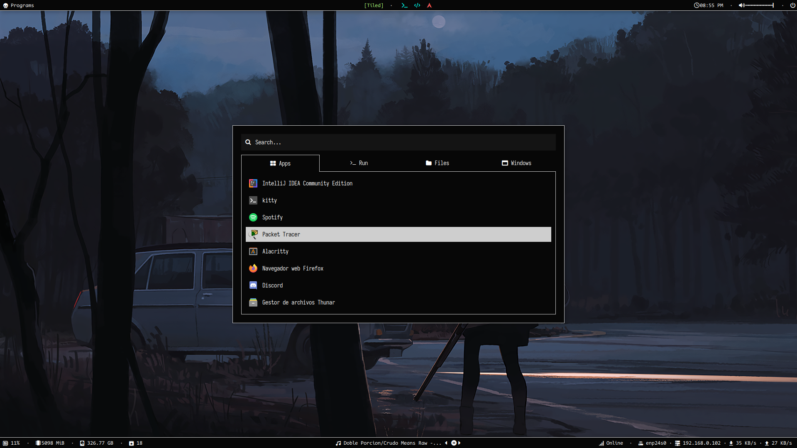
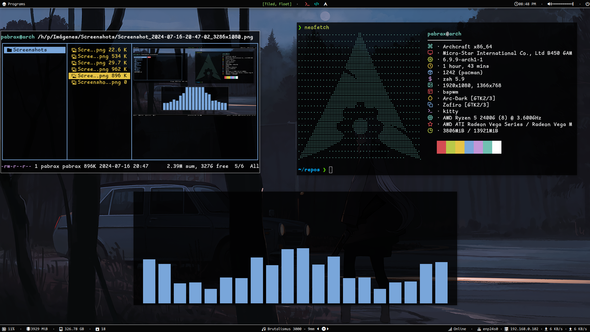
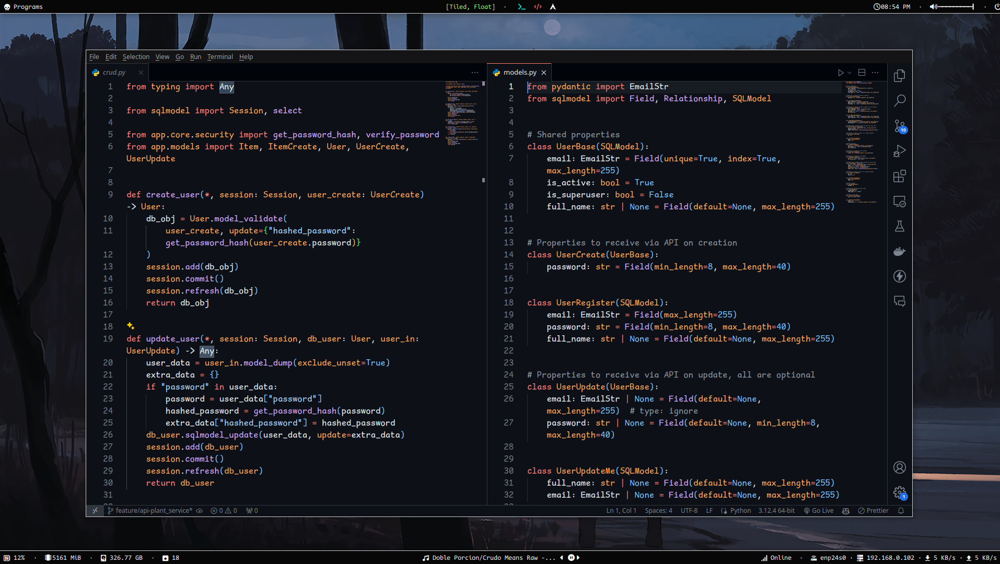
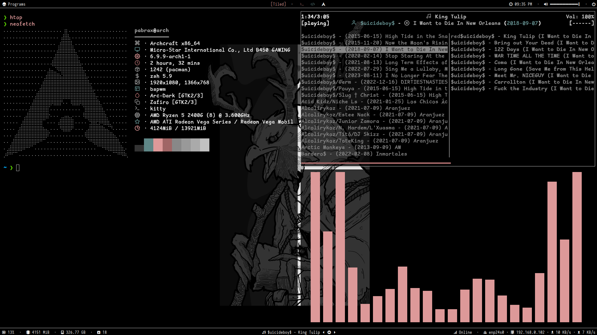
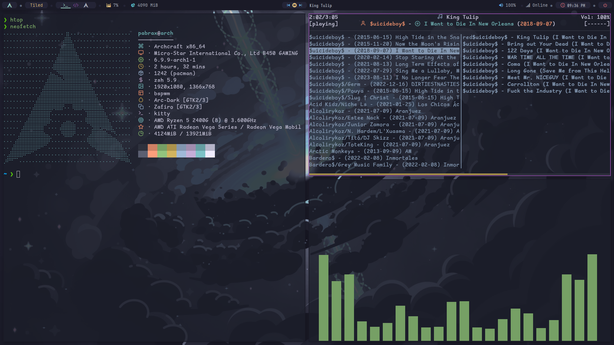
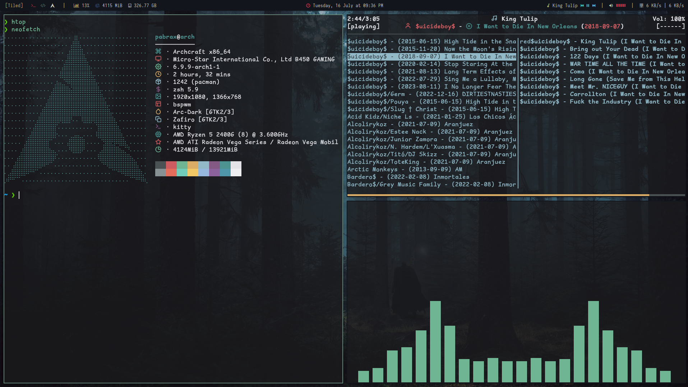
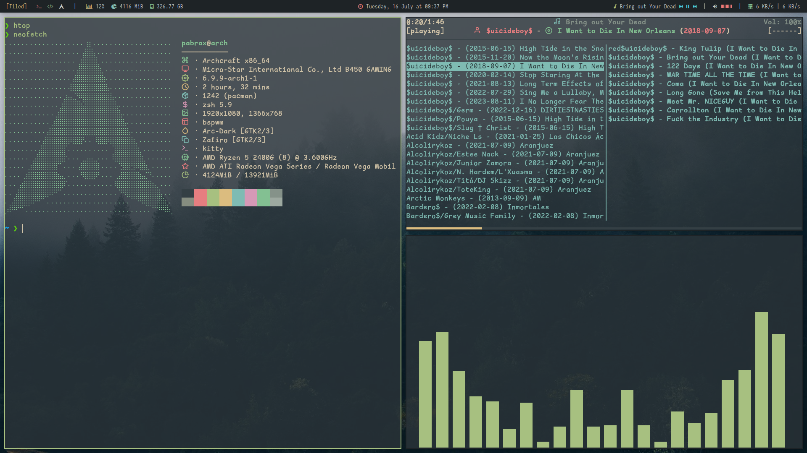
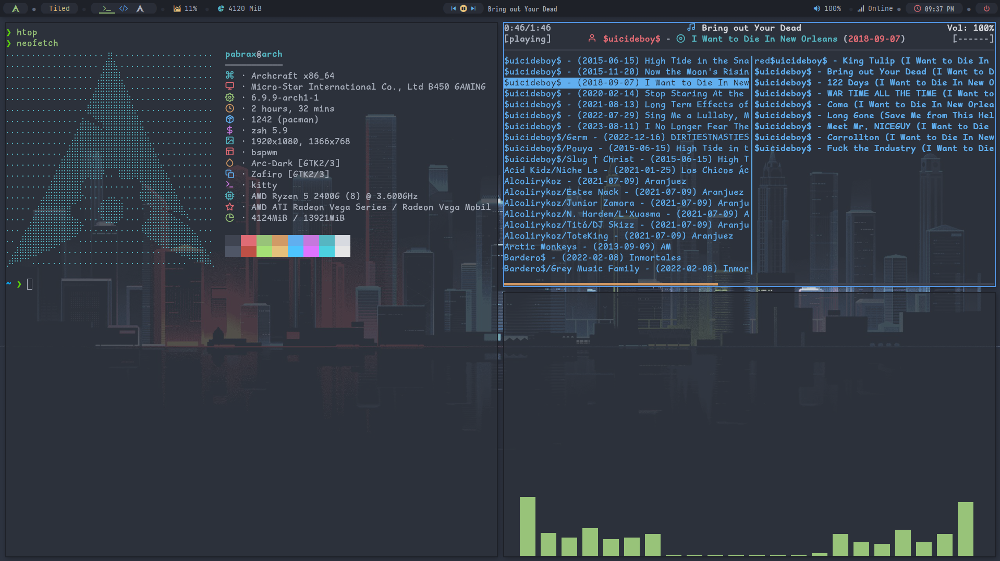
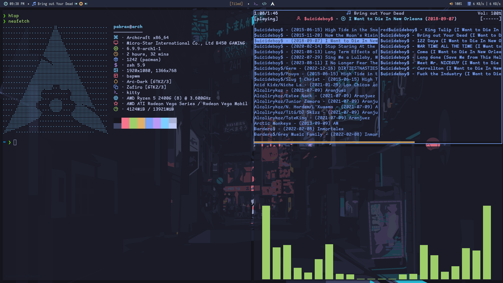

# my dots





### ***content***

- [my dots](#my-dots)
    - [***content***](#content)
- [Resumen](#resumen)
  - [wallpapers](#wallpapers)
- [setup](#setup)
  - [Paquetes escenciales](#paquetes-escenciales)
    - [Arch](#arch)
    - [debian/ubuntu](#debianubuntu)
      - [picom](#picom)
      - [pastel](#pastel)
    - [oh my zsh](#oh-my-zsh)
      - [plugins:](#plugins)
  - [fuentes](#fuentes)
    - [instalar fuentes manualmente](#instalar-fuentes-manualmente)
- [bspwm](#bspwm)
  - [keymaps](#keymaps)
    - [Terminal (kitty)](#terminal-kitty)
    - [Rofi Launcher \& Menus](#rofi-launcher--menus)
    - [Applications](#applications)
    - [System Keys](#system-keys)
    - [Bspwm](#bspwm-1)
- [Galeria](#galeria)
  - [current theme](#current-theme)
  - [Black Metal](#black-metal)
  - [Catppuccin](#catppuccin)
  - [Dark Forest](#dark-forest)
  - [Everforest](#everforest)
  - [One Dark](#one-dark)
  - [Tokyo Night](#tokyo-night)
  

# Resumen
Esta es una recopilacion de mis archivos de configuracion de mi entorno de desarrollo actual, Esta basado en una instalacion limpia de [archcraft](https://archcraft.io) que ya trae preconfigurado lo necesario para el correcto funcionamiento de este setup.

este entorno hace uso de BSPWM como manejador de ventanas y shxkd para la gestion de las teclas.

Este repositorio contiene los archivos de configuración de mi entorno de desarrollo personalizado. Está diseñado para funcionar sobre una instalación limpia de **Archcraft**, una distribución de Linux basada en Arch que viene preconfigurada con herramientas y ajustes optimizados.

El entorno utiliza BSPWM (Binary Space Partitioning Window Manager) como gestor de ventanas, proporcionando un manejo eficiente y personalizable de las ventanas en el escritorio. Para la gestión de atajos de teclado, se utiliza SXHKD (Simple X Hot Key Daemon), que permite una configuración flexible y rápida de los atajos para mejorar la productividad.

> Estos dotfiles incluyen configuraciones específicas para:

**BSPWM**: Reglas de ventana, atajos de teclado, y ajustes visuales.

**SXHKD**: Mapeo de teclas para una navegación eficiente y control del entorno.

**KITTY**: configuracion de temas, fuentes y configuraciones de la terminal.

**VSCODE**: configuracion del editor vscode (***settings.json***).

**ZSH**: mapeo de alias y temas especificos.


Con esta configuración, busco crear un entorno de desarrollo ágil, minimalista y altamente eficiente, optimizado para mis necesidades y preferencias.

Dentro de estos dotfiles tambien Se encuentran mis configuraciones de algunas aplicaciones de windows.

## wallpapers

puedes encontrar mis [wallpapers here](https://github.com/pabrax/wallpapers).

# setup

Comencemos.

primero realizamos un backup de nuestros archivos actuales y los almacenaremos en la ruta `~/.backups`.

***crear backup de archivos***

```bash
mkdir ~/.backups
cp -r ~/.* ~/.backups
```

## Paquetes escenciales

### Arch

```sh
sudo pacman -S python python-pip pastel git curl bspwm kitty sxhkd ncmpcpp mpd cmake gcc zsh rofi polybar fzf wget curl unzip vim ranger feh neofetch htop neovim bat
``` 

### debian/ubuntu

para algunos sistemas basados en Debian Es necesario compilar algunos paquetes importantes para que la configuracion principalmente de los TWM funcione.

```sh
sudo apt-get install python3 python3-pip git curl bspwm kitty sxhkd ncmpcpp mpd cmake gcc g++ zsh rofi polybar fzf vim ranger feh neofetch htop wget curl unzip
```

#### picom

para instalar picom es necesario compilar la herramienta (fundamental para la composicion de ventanas en X11), desde apt en mi caso me dio algunos errores

```bash
sudo apt-get install libconfig-dev libdbus-1-dev libegl-dev libev-dev libgl-dev libepoxy-dev libpcre2-dev libpixman-1-dev libx11-xcb-dev libxcb1-dev libxcb-composite0-dev libxcb-damage0-dev libxcb-glx0-dev libxcb-image0-dev libxcb-present-dev libxcb-randr0-dev libxcb-render0-dev libxcb-render-util0-dev libxcb-shape0-dev libxcb-util-dev libxcb-xfixes0-dev meson ninja-build uthash-dev
```

```bash
git clone https://github.com/yshui/picom.git
cd picom
```

**build**

```bash
meson setup --buildtype=release build
ninja -C build
```

**install**

```bash
ninja -C build install
```

#### pastel

obtenemos el recurso y lo instalamos
```bash
wget "https://github.com/sharkdp/pastel/releases/download/v0.8.1/pastel_0.8.1_amd64.deb"
sudo dpkg -i pastel_0.8.1_amd64.deb
```
luego eliminamos su instalador

```bash
rm -rf pastel_0.8.1_amd64.deb
```

### oh my zsh

para configurar correctamente zsh instalaremos ohmyzsh que nos permitira manejar diferentes plugins

```bash
sh -c "$(curl -fsSL https://raw.githubusercontent.com/ohmyzsh/ohmyzsh/master/tools/install.sh)"
```

#### plugins:

**powerlevel10k**
```bash
git clone --depth=1 https://github.com/romkatv/powerlevel10k.git ${ZSH_CUSTOM:-$HOME/.oh-my-zsh/custom}/themes/powerlevel10k
```

**szh syntax highlighting**
```bash
git clone https://github.com/zsh-users/zsh-syntax-highlighting.git ${ZSH_CUSTOM:-~/.oh-my-zsh/custom}/plugins/zsh-syntax-highlighting
```

**zsh autosuggestions**

```bash
git clone https://github.com/zsh-users/zsh-autosuggestions ${ZSH_CUSTOM:-~/.oh-my-zsh/custom}/plugins/zsh-autosuggestions
```


## fuentes

para instalar las fuentes necesarias simplemente puedes correr el script `fontInstaller.sh` dentro de la carpeta de `scripts`. puedes utilizar los siguientes comandos para lograrlo.

```bash
chmod +x fontsInstaller.sh
./fontsInstaller.sh
```

***el script instalara las siguientes fuentes:***
- Agave
- CascadiaCode
- CodeNewRoman
- ComicShannsMono
- Hack
- Iosevka
- JetbrainsMono
- Mononoki

Este script descargara las fuentes necesarias y las instalara directamente en el directorio `/usr/share/fonts`

### instalar fuentes manualmente

puedes visitar la pagina de [nerdfonts](https://www.nerdfonts.com/font-downloads) para encontrrar fuentes de tu agrado, simplemente descarga los archivos comprimidos, extraelos y muevelos al directorio `/usr/share/fonts` y por ultimo actualiza las fuentes

aqui un ejemplo del proceso:

```bash
cd Descargas # or Downloads
unzip fuente.zip
sudo mv *.ttf /usr/share/fonts # or use *.otf if you need
fc-cache -f -v
```

para configurar las fuentes dentro de bspwm debes acceder a la carpeta de configuracion de bspwm `$HOME/.config/bspwm/themes/TU_TEMA/` y modificar el archivo `theme.bash`


# bspwm

para modificar la configuracion de bspwm accede a la ruta `~/.config/bspwm`, dentro de esta carpeta se encuentran los archivos necesarios de configuracion para `bspwm`, `sxhkd`, `picom`, `polybar` y `rofi` 

Modifica el archivo `~/.config/bspwm/themes/nombre-del-tema/theme.sh` si quieres cambiar los parametros de ejecucion de un tema en especifico

para cambiar los keymaps accede al archivo `~/.config/bspwm/sxhkdrc`

para gestionar las reglas de bspwm y las configuraciones generales de bswpm accede al archivo `~/.config/bspwm/bspwmrc`

## keymaps

### Terminal (kitty)

| Keybinding | Action |
|------------|--------|
| `super + Return` | `bspterm` |
| `super + shift + Return` | `bspterm --float` |
| `super + alt + Return` | `bspterm --full` |

### Rofi Launcher & Menus

| Keybinding | Action |
|------------|--------|
| `alt + F1` | `rofi_launcher` |
| `alt + F2` | `rofi_runner` |
| `super + {m,n,r,s,t,w,x}` | `{rofi_music,nmd,rofi_asroot,rofi_screenshot,rofi_themes,rofi_windows,rofi_powermenu}` |

### Applications

| Keybinding | Action |
|------------|--------|
| `super + shift + {e,b,c}` | `{pcmanfm,brave,code}` |
| `ctrl + alt + {v,r,h}` | `kitty -e {vim,ranger,htop}` |
| `super + p` | `bspcolorpicker` |
| `ctrl + alt + m` | `bspmusic` |
| `ctrl + alt + l` | `betterlockscreen --lock` |

### System Keys

| Keybinding | Action |
|------------|--------|
| `super + space` | `bsplayout` |
| `Print` | `bspscreenshot --now` |
| `alt + Print` | `bspscreenshot --in5` |
| `ctrl + Print` | `bspscreenshot --win` |
| `super + Print` | `bspscreenshot --area` |
| `XF86MonBrightness{Up,Down}` | `bspbrightness{ --inc, --dec}` |
| `XF86Audio{RaiseVolume,LowerVolume}` | `bspvolume{ --inc, --dec}` |
| `XF86Audio{Mute,MicMute}` | `bspvolume{ --toggle, --toggle-mic}` |
| `XF86Audio{Next,Prev,Play,Stop}` | `mpc {next,prev,toggle,stop}` |

### Bspwm

| Keybinding | Action |
|------------|--------|
| `super + shift + h` | `bspwinmask` |
| `super + {_,shift + }q` | `bspc node -{c,k}` |
| `ctrl + alt + Escape` | `xkill` |
| `ctrl + shift + {q,r}` | `bspc {quit,wm -r}` |
| `super + Escape` | `pkill -USR1 -x sxhkd` |
| `ctrl + alt + {Left,Right}` | `bspc desktop -f {prev.local,next.local}` |
| `super + {_,shift + }{1-8}` | `bspc {desktop -f,node -d} '^{1-8}' '--follow'` |
| `super + ctrl + shift + {Left,Right}` | `bspc node -d {prev,next} '--follow'` |
| `super + {_,shift + }{Left,Down,Up,Right}` | `bspc node -{f,s} {west,south,north,east}` |
| `super + alt + shift + {Left,Down,Up,Right}` | `bspc node -v {-20 0,0 20,0 -20,20 0}` |
| `super + control + {Left,Right,Up,Down}` | `bspc node -z {left -20 0,right 20 0,top 0 -20,bottom 0 20}` |
| `super + alt + {Left,Right,Up,Down}` | `bspc node -z {left 20 0,right -20 0,top 0 20,bottom 0 -20}` |
| `super + {h,v,c}` | `bspc node -p {east,south,cancel}` |
| `super + ctrl + {1-9}` | `bspc node -o 0.{1-9}` |
| `super + l` | `bspc desktop -l next` |
| `super + f` | `bspc node -t "~"fullscreen` |
| `super + z` | `bspc node -t "~"{floating,tiled}` |
| `super + shift + z` | `bspc node -t "~"{pseudo_tiled,tiled}` |
| `super + ctrl + {m,x,y,z}` | `bspc node -g {marked,locked,sticky,private}` |
| `alt + {_,shift + }Tab` | `bspc node -f {next.local,prev.local}` |
| `super + {Tab,grave}` | `bspc {node,desktop} -f last` |

# Galeria

## current theme


## Black Metal


## Catppuccin


## Dark Forest


## Everforest


## One Dark


## Tokyo Night


