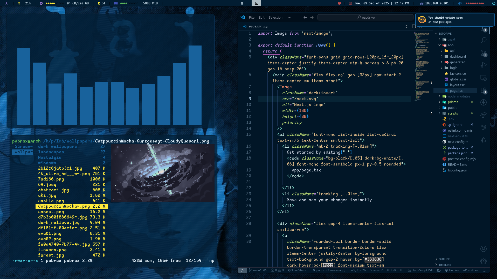
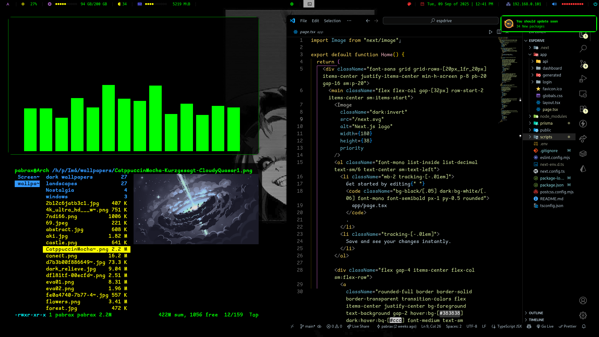
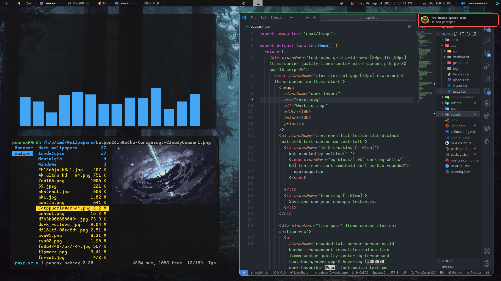
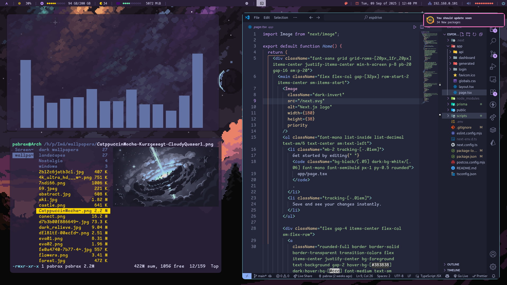
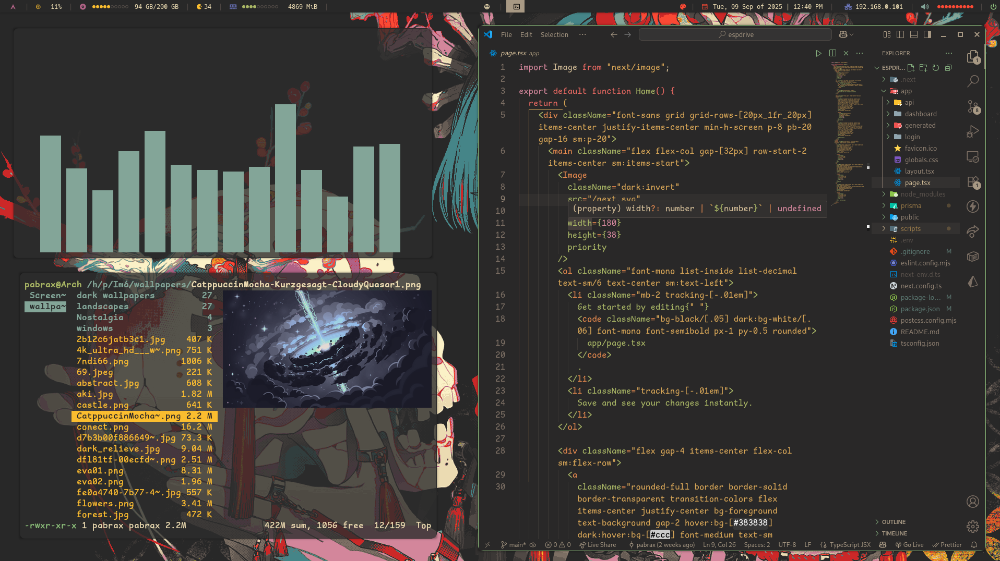
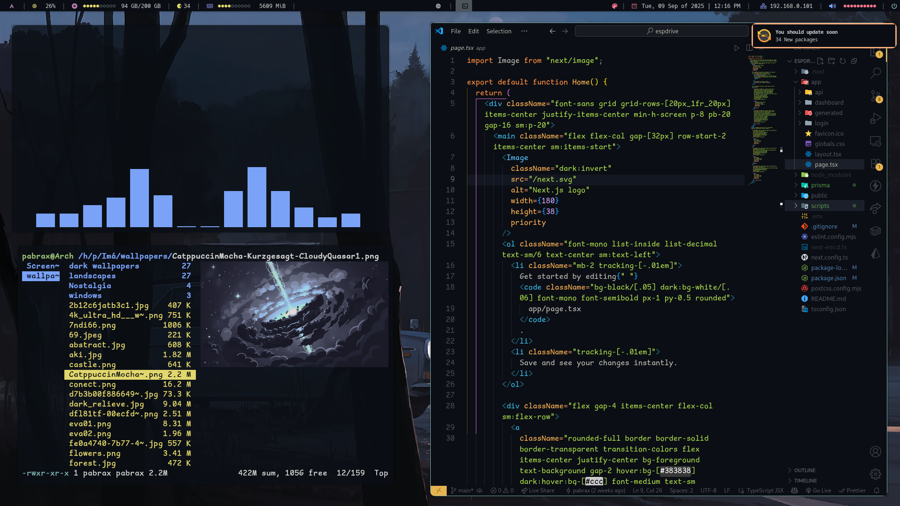
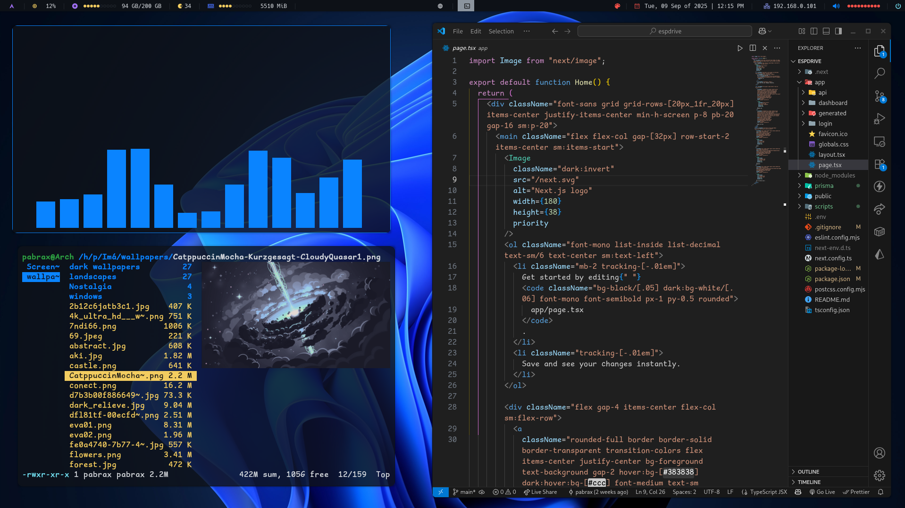

# Pabrax Dotfiles

Colección de configuraciones personales para Linux.
Este entorno está diseñado para ser **minimalista**, **funcional** y **replicable**, con soporte principal en **Arch Linux** (probado sobre **CachyOS**) y compatibilidad con **Debian/Ubuntu**.

El flujo de trabajo está basado en el **tiling window manager i3**, acompañado de herramientas como **polybar**, **rofi**, **dunst**, **picom** y **mpd** para ampliar su funcionalidad.
Para usuarios que prefieran un entorno de escritorio más tradicional, también se incluyen configuraciones para **Cinnamon**.

## Instalacion y Configuracion

Este entorno está construido sobre i3 como gestor de ventanas principal.
La idea es mantener un setup ligero pero completo:

- **i3** + **Polybar** para manejar ventanas y la barra de estado.
- **Picom** para transparencias y efectos.
- **Rofi/Dmenu** como lanzadores.
- **Dunst** para notificaciones.
- **MPD** + **Ncmpcpp** como sistema de música en terminal.

Con estos componentes tienes un escritorio funcional desde el arranque, fácil de extender con tus propias aplicaciones.

### Paquetes necesarios

Para levantar el entorno necesitas instalar un conjunto base de paquetes.

Aquí dejo los comandos según tu distribución:

- **Arch Linux / CachyOS**:

```bash
sudo pacman -S --needed \
lightdm lightdm-gtk-greeter i3-wm i3status i3blocks i3lock-color picom polybar rofi dmenu udiskie \
kitty bash bash-completion zsh \
bat fd ripgrep fzf eza btop htop neovim feh nitrogen lxappearance pavucontrol arandr dunst flameshot mpd ncmpcpp grub-customizer zathura zathura-pdf-mupdf

```

- **Debian / Ubuntu**:

```bash
sudo apt update && sudo apt install -y \
lightdm lightdm-gtk-greeter i3 i3status i3lock picom polybar rofi dmenu udiskie \
kitty bash bash-completion zsh \
bat fd-find ripgrep fzf exa btop htop neovim feh nitrogen lxappearance pavucontrol arandr dunst flameshot mpd ncmpcpp

```

- **Dependencias extra para Udiskie en Debian**:

```bash
sudo apt-get install python-setuptools udisks2 python-pip python-gobject python-yaml libgio2.0 gobject-introspection libgtk2.0-0 libnotify4 gettext gir1.2-notify-0.7\
```

#### Otras Distros

No me cierro a Arch o Debian. La mayoría de paquetes están en repositorios estándar:

- En **Fedora**, usa `dnf install ...`.

- En **NixOS**, agrega los mismos nombres a tu `configuration.nix`.

- La idea es que sea **portable** y fácil de reproducir en cualquier **sistema Linux** que soporte **i3** y sus herramientas.


### Paquetes Opcionales

El entorno base funciona perfectamente sin nada más, pero hay un conjunto de aplicaciones que uso en mi día a día: **navegadores alternativos**, **editores**, **IDEs**, **multimedia**, etc.

Estas apps no forman parte del núcleo y cada usuario puede decidir si instalarlas o no.

### Instalar paru (Derivadas de Arch)

Para instalar paquetes opcionales desde el **AUR** es necesario tener un **AUR** helper como **paru**.

Si no lo tienes instalado, primero agrega:

```bash
sudo pacman -S --needed base-devel git
git clone https://aur.archlinux.org/paru.git
cd paru
makepkg -si
```

Una vez listo, puedes instalar los paquetes opcionales con:

```bash
paru -S --needed \
brave-bin discord obsidian visual-studio-code-bin \
intellij-idea-community-edition azuredatastudio-bin postman-bin \
vlc gimp blender betterlockscreen
```

tambien hay otras utilidades como `spotdl` para descargar musica desde spotify. La podemos instalar con:


```bash
pip install spotdl
```
- Si estas en Debian o distros que tienen python2 y python3 puedes utilizar `pip3` en lugar de `pip`.
- aveces pasa que al instalarse de manera global pide que agreguemos el parametro `--break-system-packages`, que generalmente pasa ya que puede haber problema de dependencias entre librerias de python, si esto no te afecta o no es tu caso puedes agregar este comando, si no es asi, puedes buscar mas Documentacion sobre [spotdl]().

### Otros sistemas

En distribuciones fuera del ecosistema **Arch**, los mismos programas se pueden conseguir vía repositorios oficiales, **Flatpak**, **Snap** o descargas directas (**.deb**/**.rpm**/**.AppImage**).
Aquí dejo una lista categorizada con los más relevantes:

- **Navegadores / comunicación**: Brave, Discord
- **Notas y productividad:** Obsidian, VSCode
- **Desarrollo**: IntelliJ IDEA, Azure Data Studio, Postman
- **Multimedia**: VLC, GIMP, Blender

Cada uno tiene su propio método de instalación en **Debian**, **Ubuntu** o **Fedora** (ej. `apt install vlc gimp`, `flatpak install flathub com.spotify.Client`, etc.), pero lo importante es que sepas qué aplicaciones complementan el entorno más allá del core.

## Fuentes

Este entorno utiliza fuentes personalizadas (**Nerd Fonts**, **JetBrainsMono**, **FiraCode**, etc.) para mejorar la integración visual en terminales, barras y lanzadores.

En el repositorio existe una carpeta `fonts/` que contiene los archivos comprimidos (**.zip**) de las fuentes necesarias.

Para instalarlas automáticamente en tu sistema, **ejecuta** el script incluido:

```bash
./scripts/install-fonts.sh
```

Este script:

1. Crea (si no existe) la carpeta `~/.local/share/fonts/`.
2. Descomprime todos los `.zip` encontrados en `fonts/`.
3. Actualiza la caché de fuentes con `fc-cache -fv`.

De esta forma, las fuentes quedan disponibles para tu usuario sin necesidad de permisos de root.

*(Si deseas instalarlas a nivel global, puedes adaptar el script para usar `/usr/share/fonts` en lugar de `~/.local/share/fonts`.)*

```
📂 Estructura esperada
dotfiles/
├── fonts/
│   ├── CodenewRoman.zip
│   ├── JetBrainsMono.zip
│   ├── FiraCode.zip
│   └── NerdFonts.zip
└── scripts/
    └── install-fonts.sh
```

## Repositorios de BlackArch(Solo Arch y derivados)

El repositorio de BlackArch ofrece miles de herramientas enfocadas en **seguridad**, **pentesting** y **auditorías**.
No es necesario para el funcionamiento normal del entorno, pero lo incluyo como opción si quieres convertir tu sistema en un **laboratorio de seguridad**.

### Instalacion del Repositorio de blackarch

Ejecuta lo siguiente en sistemas basados en **Arch** (**Arch**, **CachyOS**, **EndeavourOS**, **etc**.):

```bash
curl -O https://blackarch.org/strap.sh
chmod +x strap.sh
sudo ./strap.sh
```

Esto agregará automáticamente el repositorio de BlackArch a tu `pacman.conf` y sincronizará las claves necesarias.


### Verificacion de instalacion

Una vez agregado el repo, actualiza el sistema para confirmar que funciona correctamente:

```bash
sudo pacman -Syyu
```

Puedes comprobar que los paquetes de **BlackArch** están disponibles con:

```bash
pacman -Ss blackarch
```

### Nota

- BlackArch está pensado para pentesting profesional y entornos controlados.
- Instalar todos los paquetes puede sobrecargar tu sistema; elige solo lo que vayas a usar.


## Keybindings

Esta es una lista de keybindings relacionadas a i3 y el uso del entorno

### **Kebindings de i3**

| Atajo          | Acción                             |
| -------------- | ---------------------------------- |
| `$mod+Shift+c` | Recargar configuración de i3       |
| `$mod+Shift+r` | Reiniciar i3 sin cerrar sesión     |
| `$mod+x`       | Menú de apagado (`powermenu.sh`)   |
| `$mod+o`       | Bloquear pantalla (`dm-tool lock`) |


### **Lanzadores de Aplicaciones**

| Atajo          | Acción                             |
| -------------- | ---------------------------------- |
| `$mod+Return`  | Abrir terminal (kitty)             |
| `$mod+b`       | Abrir navegador (Brave)            |
| `$mod+e`       | Abrir gestor de archivos (Nemo)    |
| `$mod+c`       | Abrir VS Code                      |
| `$mod+d`       | Abrir Rofi (launcher)              |
| `$mod+Shift+z` | Cambiar layout de teclado (script) |
| `$mod+t`       | Cambiar tema (style-switch.sh)     |


### **Multimedia y sonido**

| Atajo                  | Acción                            |
| ---------------------- | --------------------------------- |
| `XF86AudioRaiseVolume` | Subir volumen                     |
| `XF86AudioLowerVolume` | Bajar volumen                     |
| `XF86AudioMute`        | Silenciar/activar salida de audio |
| `XF86AudioMicMute`     | Silenciar/activar micrófono       |


### **Capturas y utilidades**

| Atajo          | Acción                              |
| -------------- | ----------------------------------- |
| `$mod+Shift+s` | Captura de pantalla (Flameshot GUI) |


### **Manejo de Ventanas**

| Atajo                | Acción                                      |
| -------------------- | ------------------------------------------- |
| `$mod+q`             | Cerrar ventana                              |
| `$mod+j/k/l/;`       | Mover foco (izquierda/abajo/arriba/derecha) |
| `$mod+Shift+j/k/l/;` | Mover ventana en dirección respectiva       |
| `$mod+h`             | Dividir en horizontal                       |
| `$mod+v`             | Dividir en vertical                         |
| `$mod+f`             | Pantalla completa                           |
| `$mod+s`             | Layout apilado (stacking)                   |
| `$mod+w`             | Layout en pestañas (tabbed)                 |
| `$mod+p`             | Alternar layout dividido                    |
| `$mod+Shift+space`   | Alternar ventana flotante/tiling            |
| `$mod+space`         | Alternar foco entre tiling/floating         |
| `$mod+a`             | Foco al contenedor padre                    |
| `$mod+Shift+d`       | Foco al contenedor hijo                     |

### **Redimensionar Ventanas**

| Atajo    | Acción                 |
| -------- | ---------------------- |
| `j`      | Reducir ancho          |
| `l`      | Reducir alto           |
| `k`      | Aumentar alto          |
| `;`      | Aumentar ancho         |
| `←/→`    | Reducir/aumentar ancho |
| `↑/↓`    | Reducir/aumentar alto  |
| `Return` | Salir de resize mode   |
| `Escape` | Salir de resize mode   |
| `$mod+r` | Salir de resize mode   |

### **Espacios de trabajo**

| Atajo             | Acción                                     |
| ----------------- | ------------------------------------------ |
| `$mod+1..0`       | Cambiar al workspace correspondiente       |
| `$mod+Shift+1..0` | Mover ventana al workspace correspondiente |


## Themes

### Cambiar de Tema

El entorno incluye un **theme switcher** integrado con **i3**.  
Con el atajo:

```i3
bindsym $mod+t exec ~/.config/polybar/layer0/scripts/style-switch.sh
```
puedes abrir un **Rofi menu** que muestra todos los temas disponibles.  
Desde ahí eliges uno y automáticamente se aplican los cambios en:

- **Polybar**
- **i3 (bordes y colores de ventanas)**
- **Kitty (terminal)**
- **Dunst (notificaciones)**
- **VSCode (tema gráfico)**
- **Wallpaper y pantalla de bloqueo**

No necesitas abrir la terminal ni correr comandos: todo el flujo pasa por el menú visual.

---

### Crear o Modificar un Tema

1. Edita el archivo `styles.sh` donde se definen las paletas de colores.  
2. Copia un bloque de un tema existente y ajusta sus valores (`BG`, `FG`, `RED`, etc.).  
3. Asigna el nombre del tema de VSCode a la variable `vscode_theme`.  
4. Guarda y selecciona el nuevo tema desde el menú con `$mod+t`.  

*(Opcional: si quieres asociar un wallpaper, edítalo también en `wallpaper-switch.sh`.)*

---

### Galería de Temas (Layer0)

> Accede con `$mod+t` → selecciona el tema en el menú.

- **Blue** – fondo azulado oscuro, VSCode: *Night Owl* 



- **Console** – estilo retro verde sobre negro, VSCode: *Black*  




- **Dark** – minimalista, contrastes fuertes, VSCode: *One Dark Pro Darker*  




- **Synthwave** – neón retrofuturista, VSCode: *Catppuccin Macchiato*  



- **Gruvbox** – tonos cálidos y tierra, VSCode: *Gruvbox Material Dark*  



- **Ayu Dark** – sobrio y equilibrado, VSCode: *Ayu Dark*  



- **Windows Style** – moderno tipo Fluent, VSCode: *Visual Studio Dark*  



---